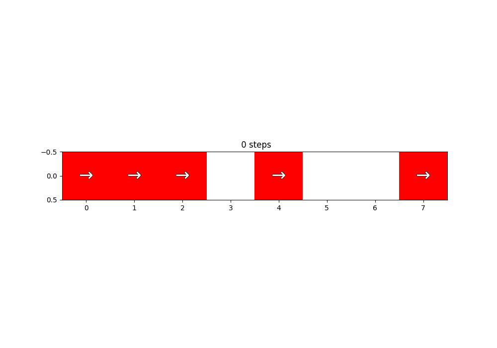
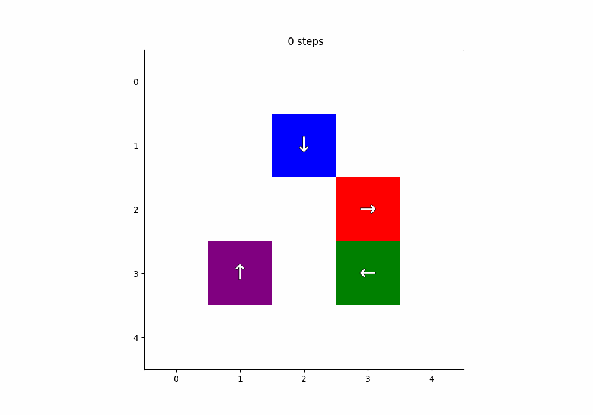
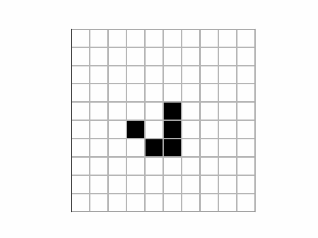
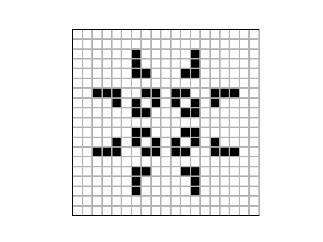
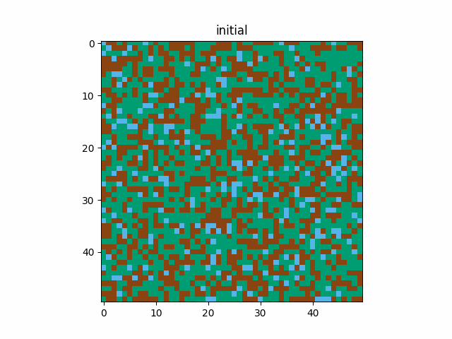
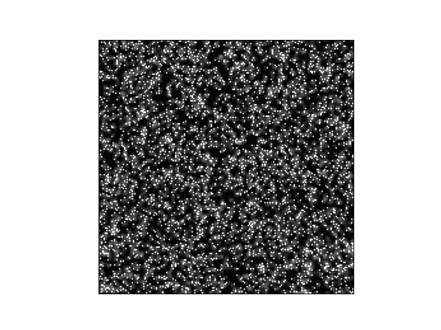

# automata
PHYS 349 Cellular Automata Project

## Dependencies

- numpy
- matplotlib
- typing

## Subclassing

Tests are created in `automata/tests` to demonstrate working examples of different `CA` subclasses. Explicit documentation is also included in `code/ca.py`'s documentation

## Example Output Animations

1D and 2D [Traffic Simulation](https://doi.org/10.1007/978-1-4939-8700-9_57):

  
  

[Conway's Game of Life](https://en.wikipedia.org/wiki/Conway%27s_Game_of_Life) glider and pulsar:

  
  

[Forest Fire Simulation](https://doi.org/10.1007/978-1-4939-8700-9_57):

  
  

[Slime Mould Simulation](https://doi.org/10.1162/artl.2010.16.2.16202):

  

  
  

